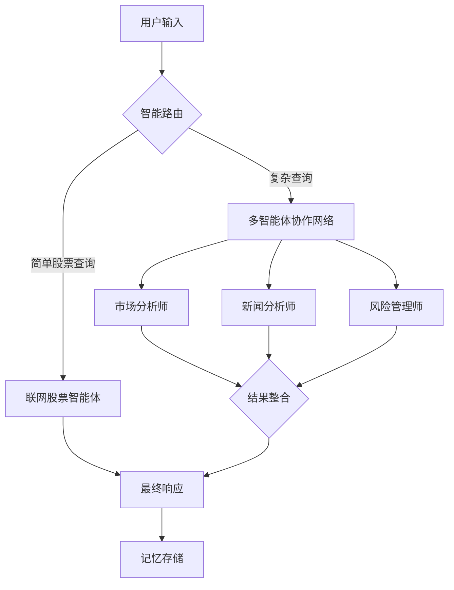

# 金融智能体系统 (FinanceAgents)

<div align="center">
  
  <p>基于多智能体协作的金融分析与投资建议平台</p>
</div>

## 📑 目录

- [项目概述](#项目概述)
- [系统架构](#系统架构)
- [核心功能](#核心功能)
- [技术实现](#技术实现)
- [安装指南](#安装指南)
- [使用方法](#使用方法)
- [功能示例](#功能示例)
- [项目结构](#项目结构)
- [注意事项](#注意事项)
- [许可证](#许可证)

## 🌟 项目概述

金融智能体系统（FinanceAgents）是一个基于多智能体协作架构的金融分析与投资建议平台，旨在为用户提供全面、专业的金融市场洞察和投资决策支持。系统整合了联网股票智能体、本地数据分析工具以及多种金融数据源，通过智能路由和协作机制，为用户提供实时、精准的金融信息和投资建议。

核心特点：
- **联网股票智能体**：通过API接入专业股票智能体，提供实时市场分析和投资建议
- **多智能体协作**：市场分析师、新闻分析师、风险管理师等专业角色协同工作
- **混合数据源**：结合实时网络数据和本地分析工具，确保信息全面性
- **智能路由机制**：根据查询复杂度自动选择最佳处理路径
- **记忆系统**：基于ChromaDB的用户交互记忆，实现个性化服务
- **Web界面**：基于Streamlit构建的直观交互界面

## 🏗️ 系统架构

金融智能体系统采用分层架构设计：

1. **前端层**：Streamlit构建的Web界面，提供用户交互和结果展示
2. **路由层**：根据查询类型和复杂度，决定使用直接查询或多智能体协作
3. **智能体层**：
   - **联网股票智能体**：通过API接入的专业金融分析智能体
   - **专业智能体**：市场分析师、新闻分析师、风险管理师等
4. **数据层**：
   - **外部数据源**：股票API、新闻API等
   - **本地数据源**：yfinance、stockstats等
5. **记忆层**：基于ChromaDB的用户交互记忆系统

系统工作流：



## 🔍 核心功能

### 股票分析与评估
- 实时股价查询与走势分析
- 技术指标分析（如MA、MACD、RSI等）
- 基本面分析（财务报表、业绩预期等）
- 投资价值评估

### 市场洞察
- 全球市场概览（美股、港股、A股等）
- 行业趋势分析
- 热点板块追踪
- 宏观经济指标解读

### 投资建议
- 个性化投资组合推荐
- 风险评估与管理
- 投资策略制定
- 资产配置建议

### 新闻与舆情分析
- 相关新闻聚合
- 舆情情感分析
- 重大事件影响评估
- 市场情绪监测

## 💻 技术实现

### 核心技术栈
- **联网股票智能体**：基于豆包API的专业金融分析能力
- **本地分析工具**：yfinance、stockstats等Python库
- **记忆系统**：ChromaDB向量数据库
- **前端框架**：Streamlit
- **多智能体协作**：基于LangGraph的工作流编排

### 关键实现细节
- **智能路由机制**：通过关键词匹配和查询复杂度评估，决定使用联网智能体或本地工具
- **流式响应**：支持实时流式输出，提升用户体验
- **故障转移**：当联网智能体不可用时，自动切换到本地分析工具
- **记忆检索**：基于语义相似度的历史交互检索，实现个性化服务

## 📦 安装指南

### 环境要求
- Python 3.8+
- pip 包管理工具

### 安装步骤

1. 克隆仓库
```bash
git clone https://github.com/yourusername/FinanceAgents.git
cd FinanceAgents
```

2. 安装依赖
```bash
pip install -r requirements.txt
```

3. 配置环境变量
```bash
# 复制环境变量模板
cp .env.example .env

# 编辑.env文件，填入API密钥
# DOUBAO_API_KEY=your_api_key
# STOCK_API_KEY=your_stock_api_key
# STOCK_BOT_ID=your_bot_id
```

## 🚀 使用方法

### 命令行模式
```bash
# 直接查询
python main.py -q "请分析苹果公司的股票"

# 流式输出
python main.py -q "分析腾讯股票的投资价值" -s

# 指定用户ID（用于记忆系统）
python main.py -q "最近有哪些值得投资的科技股？" -u user123
```

### Web界面
```bash
# 启动Streamlit应用
streamlit run app.py
```

启动后，在浏览器中访问 http://localhost:8501 即可使用Web界面。

## 📊 功能示例

### 股票分析
```
> 请分析苹果公司的股票

### 苹果公司（AAPL）股票分析（截至2025年8月）

#### 一、核心业绩与市场表现
1. **iPhone出货量与营收趋势**
   - **出货量下滑但结构优化**：2024年第四季度（4Q24）iPhone 16系列出货量约6,600万部...
   [分析内容]
```

### 投资建议
```
> 最近有哪些值得投资的科技股？

结合当前市场动态及行业趋势，以下科技领域相关标的及方向具有一定关注价值...
[建议内容]
```

## 📁 项目结构

```
FinanceAgents/
├── app.py                 # Streamlit Web应用
├── main.py                # 命令行入口
├── config.py              # 配置文件
├── requirements.txt       # 依赖列表
├── .env.example           # 环境变量模板
├── assets/                # 静态资源
├── llm/                   # 大模型相关
│   ├── __init__.py
│   └── doubao_client.py   # 豆包API客户端
├── memory/                # 记忆系统
│   ├── __init__.py
│   └── memory_system.py   # ChromaDB记忆实现
└── tradingagents/         # 智能体实现
    ├── agents/            # 各类智能体
    │   ├── __init__.py
    │   └── utils/         # 工具函数
    │       ├── __init__.py
    │       └── agent_utils.py  # 工具包
    ├── dataflows/         # 数据流处理
    └── graph/             # LangGraph工作流
```

## ⚠️ 注意事项

- 本系统提供的分析和建议仅供参考，不构成任何投资建议
- 投资有风险，入市需谨慎
- 使用前请确保已配置正确的API密钥
- 联网功能依赖于外部API服务的可用性
- 本地分析功能可能受限于数据源的更新频率和准确性

## 📄 许可证

本项目采用 [MIT 许可证](LICENSE)。

---

<div align="center">
  <p>© 2025 金融智能体系统 - 由豆包API和多智能体协作技术驱动</p>
</div>
