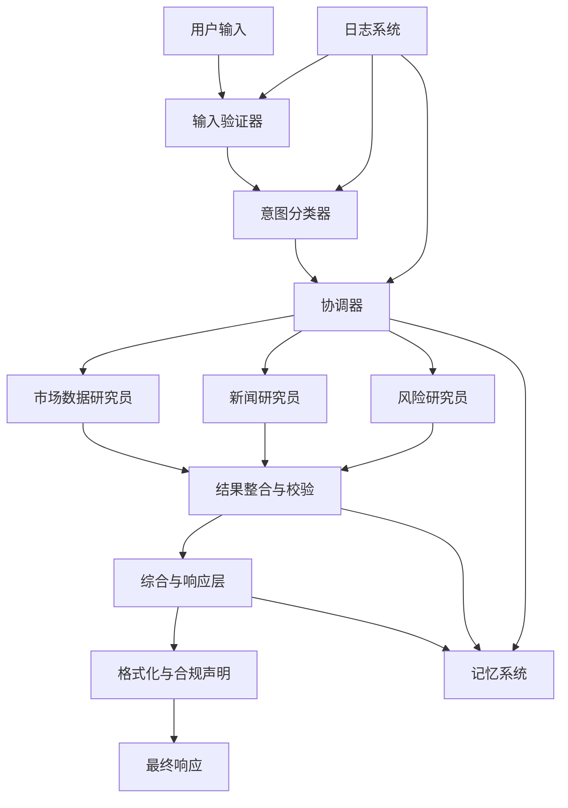

# FinanceAgents 系统架构

## 组件说明

### 1. 输入验证器
- 清理和验证用户输入
- 过滤恶意或无关查询
- 确保输入的基本完整性

### 2. 意图分类器
- 识别用户目标和实体
- 将自然语言解析为结构化任务
- 提取关键信息（股票代码、金额、风险偏好等）

### 3. 协调器(中控智能体)
- 管理有状态的工作流
- 调用专业智能体
- 整合各智能体结果

### 4. 专业智能体
- **市场数据研究员**: 获取价格、交易量等量化市场数据
- **新闻研究员**: 抓取相关新闻并进行情感分析
- **风险研究员**: 分析波动性和风险因素

### 5. 结果整合与校验
- 验证各智能体结果的一致性
- 处理冲突信息
- 生成统一分析视图

### 6. 综合与响应层
- 将所有收集的数据整合成连贯响应
- 生成符合用户问题的自然语言回答

### 7. 格式化与合规声明
- 添加必要的免责声明
- 格式化输出以适应UI
- 确保专业性和合规性

### 8. 记忆系统
- 存储用户特定的上下文和长期记忆
- 支持结构化查询和语义检索
- 实现用户个性化

### 9. 日志系统
- 记录系统操作
- 确保智能体交互的全链路可追溯性
- 支持调试和优化 